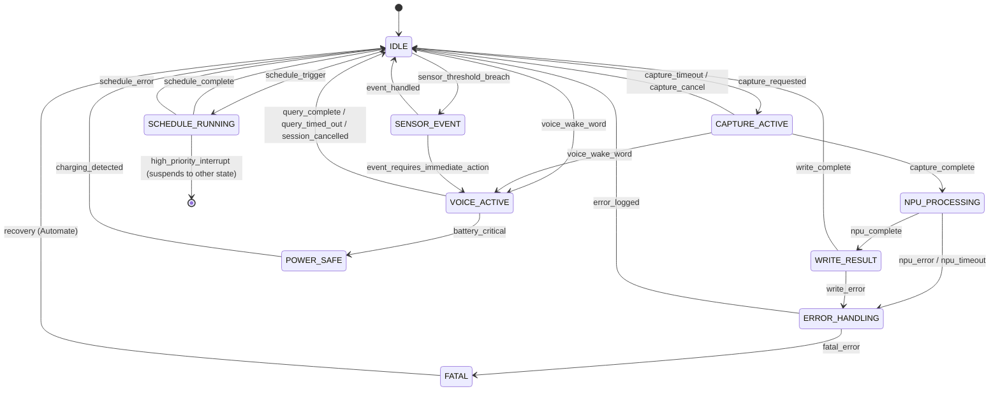

# Trigger Propagation Model — State Machine

## Overview

Events from the Android environment must propagate through three layers to reach the MCP server tool invocation. This document defines the state machine that governs that propagation.

```
┌─────────┐     ┌──────────┐     ┌───────────┐     ┌──────────────┐
│ Automate │────▶│ Shizuku │────▶│  Termux   │────▶│  MCP Server  │
│ Flow     │     │ rish    │     │ Daemon    │     │  Tool Call   │
└─────────┘     └──────────┘     └───────────┘     └──────────────┘
```

---

## State Machine

### State 1: IDLE

**Default state.** MCP server is running, NPU tools are loaded, sensor polling is idle (no active subscriptions).

**Transitions:**
- `event: capture_requested` → **CAPTURE_ACTIVE**
- `event: schedule_trigger` → **SCHEDULE_RUNNING**
- `event: voice_wake_word` → **VOICE_ACTIVE**
- `event: sensor_threshold_breach` → **SENSOR_EVENT**

### State 2: CAPTURE_ACTIVE

A capture tool is actively running (recording audio, capturing image, waiting for share).

**Sub-states:**
- `audio_in_progress` — microphone is recording, VAD gate is open
- `image_in_progress` — camera is active, waiting for frame
- `share_waiting` — MCP server is listening on the Termux share-receive socket

**Transitions:**
- `event: capture_complete` → **NPU_PROCESSING**
- `event: capture_timeout` → **IDLE** (with TIMEOUT error stored)
- `event: capture_cancel` → **IDLE**
- `event: voice_wake_word` (during audio capture) → preempt current capture, transit to **VOICE_ACTIVE**

### State 3: NPU_PROCESSING

NPU is actively computing (transcribing, OCR-ing, embedding, classifying, or running fast-path inference).

**Sub-states:**
- `transcribing` — Whisper running
- `ocr_running` — OCR model running
- `embedding` — embedding model running
- `classifying` — intent classifier running
- `fast_llm` — 1-3B model inference running

**Important:** Only ONE NPU inference can run at a time (hardware constraint). NPU_PROCESSING is the single-instance gate.

**Transitions:**
- `event: npu_complete` → **WRITE_RESULT**
- `event: npu_error` → **ERROR_HANDLING**
- `event: npu_timeout` (no response from NPU in 30s for small models, 120s for Whisper) → **ERROR_HANDLING**

### State 4: WRITE_RESULT

Writing pipeline output to `~/ingest/processed/`.

**Transitions:**
- `event: write_complete` → **IDLE**
- `event: write_error` (disk full, permission error) → **ERROR_HANDLING**

### State 5: VOICE_ACTIVE

Voice AI interactive session is active. Phone is streaming audio → transcribing → MCP routing (either NPU fast-path or laptop CUDA).

**Sub-states:**
- `listening` — wake word detected, audio stream is active
- `transcribing` — NPU Whisper is processing the utterance
- `routing` — classified intent, waiting for response (from phone NPU or laptop CUDA)
- `speaking` — TTS playback active

**Transitions:**
- `event: query_complete` → **IDLE**
- `event: query_timed_out` (no response from laptop within 15s) → fall back to phone local model answers with the offline disclaimer per offline-autonomy-model → **IDLE**
- `event: session_cancelled` (user says "stop" or proximity sensor triggered) → **IDLE**
- `event: battery_critical` → **POWER_SAFE**

### State 6: SCHEDULE_RUNNING

Subconscious Scheduler workflow is executing.

**Sub-states:**
- `flake_check` — poll the GitHub API for nixpkgs/flake-input movement (no nix on the phone)
- `model_preload` — downloading/verifying Ollama model files
- `health_check` — pinging laptop, checking services
- `gc` — queue a gc request for the laptop agent (delivered via the offline queue; the phone never executes laptop commands)

**Transitions:**
- `event: schedule_complete` → **IDLE** (result logged to `~/ingest/processed/scheduled/`)
- `event: schedule_error` (network down, laptop unreachable, command failed) → log error, retry with exponential backoff (max 3 retries), then **IDLE**
- `event: high_priority_interrupt` (voice wake word, critical Shizuku signal) → suspend schedule, transition to appropriate state, resume schedule after 30s idle

### State 7: SENSOR_EVENT

A sensor threshold was breached (light changed significantly, phone moved from stationary to walking, new BSSID detected).

**Transitions:**
- `event: event_handled` → **IDLE**
- `event: event_requires_immediate_action` (potentially security: phone moving while laptop is unlocked) → **VOICE_ACTIVE** or push notification via `phone.system.notify`

### State 8: ERROR_HANDLING

A non-fatal error occurred. Logs the error with stack trace to `~/ingest/errors/YYYYMMDD_error.log`, increments the error counter for the source tool. If same tool fails >5 times in 10 minutes, disables the tool and sends a system notification.

**Transitions:**
- `event: error_logged` → **IDLE**
- `event: fatal_error` (MCP server crash, NPU driver unresponsive, storage full) → **FATAL**

### State 9: FATAL

MCP server is unable to continue. Shizuku and Termux remain running but MCP server process terminates.

**Recovery:** Automate flow detects MCP server process absence via periodic `pgrep`, restarts Termux daemon. If restart fails 3 times in 5 minutes, sends persistent notification: "MCP server crashed. Manual restart required."

### State 10: POWER_SAFE

Battery < 15% and not charging. All non-critical NPU inference is suspended. Only voice wake word and critical Shizuku events are processed.

**Transitions:**
- `event: charging_detected` → **IDLE**
- `event: battery_critical` (< 5%) → server idles all loops (no true process sleep exists in Termux); resumes on charging_detected

---

## State Machine Diagram (text)



## Power-State Transition Matrix

| Current | Charging | Battery 15-100% | Battery <15% | Battery <5% |
|---|---|---|---|---|
| IDLE | Stay IDLE | Stay IDLE | → POWER_SAFE | → deep sleep |
| CAPTURE_ACTIVE | Continue | Continue | Finish current, → POWER_SAFE | Finish current, deep sleep |
| NPU_PROCESSING | Continue | Continue | Finish current, → POWER_SAFE | Abort, deep sleep |
| VOICE_ACTIVE | Continue | Continue | → POWER_SAFE, allow voice only | Deep sleep |
| SCHEDULE_RUNNING | Continue | Continue | Finish current task, → POWER_SAFE | Abort, deep sleep |

## Concurrency Rules

1. **Single NPU inference at a time.** All NPU_PROCESSING sub-states are mutually exclusive. Queued via priority queue.
2. **Voice preempts everything.** Voice wake word during any state transitions to VOICE_ACTIVE. Current NPU inference is cancelled and requeued from scratch (no suspend/resume per D8).
3. **Capture runs alongside scheduler.** CAPTURE_ACTIVE and SCHEDULE_RUNNING can coexist — capture uses mic/camera, scheduler uses network. They only conflict if both need NPU simultaneously, in which case capture wins.
4. **Schedule is the lowest priority.** Can be interrupted by anything. Resumes after 30s of idle state.
